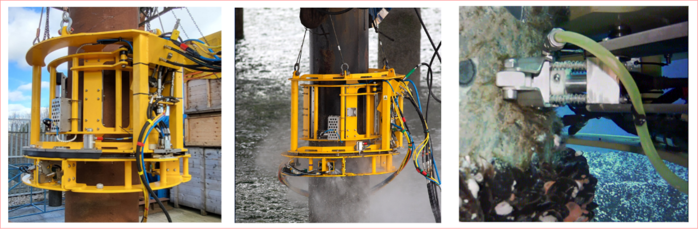
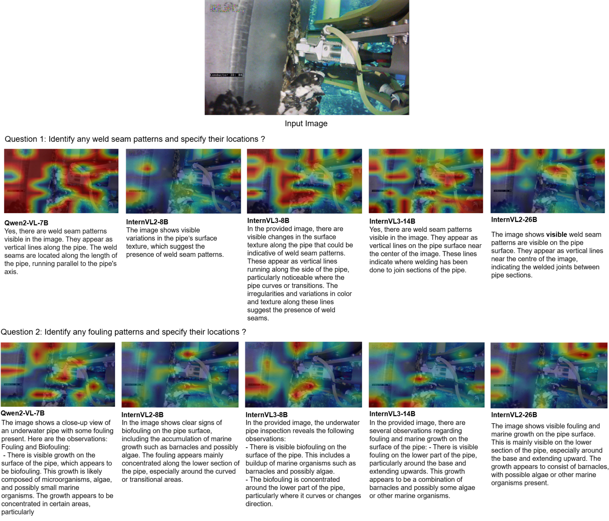
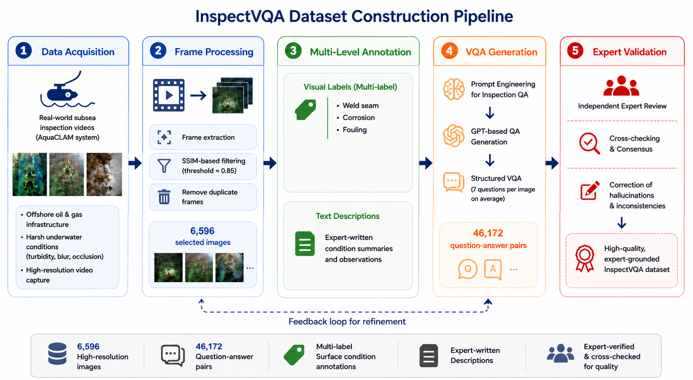
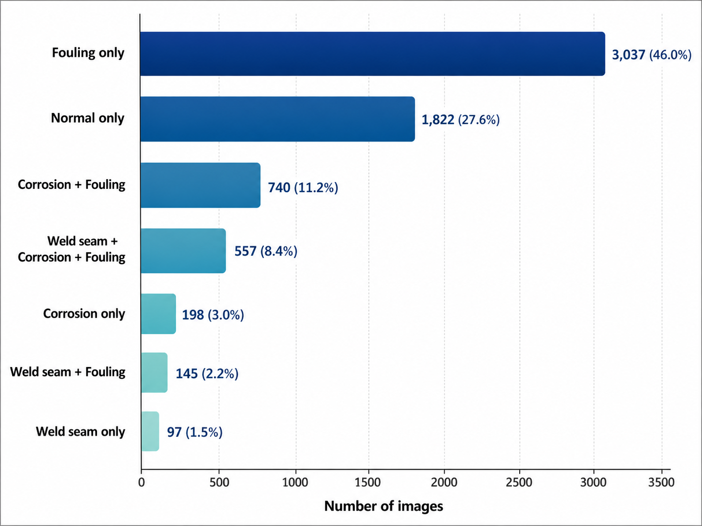

# InspectVQA: Expert-Verified Visual Reasoning for Underwater Pipe Inspection
<!-- [](./) -->
[](https://huggingface.co/datasets/anonymousSubmissionVqa2026/InspectVQA)
[](https://creativecommons.org/licenses/by-nc-sa/4.0/)

## Overview

**InspectVQA** is an expert-grounded visual question answering dataset and benchmark for real-world subsea pipe inspection. It is designed to evaluate whether large vision-language models can recognise, localise, and explain inspection-relevant surface conditions under challenging underwater environments.

The dataset contains high-resolution subsea inspection images collected from operational offshore inspection systems, together with multi-label surface-condition annotations and expert-validated inspection-oriented question-answer pairs.

InspectVQA focuses on realistic subsea visual ambiguity, including:

- low visibility and turbidity;
- non-uniform illumination and colour attenuation;
- marine fouling and surface degradation;
- corrosion-like stains, coating changes, and maintenance artefacts;
- partial occlusion from inspection tools or marine growth;
- co-occurring surface conditions within the same frame.

Unlike standard industrial anomaly detection datasets collected under controlled conditions, InspectVQA targets **domain-grounded multimodal reasoning** for safety-critical underwater inspection.

## Visual Examples

### Inspection Platform

<p align="center">
  
</p>

**Figure 1.** Inspection platform used for offshore subsea pipe/conductor inspection. The images show the inspection device, deployment around the structure, and the integrated underwater camera view.

### LVLM Reasoning and Visual Focus Examples

<p align="center">
  
</p>

**Figure 2.** Example of LVLM-generated inspection responses and corresponding visual focus regions for weld seam and fouling questions.


## Dataset Highlights

| Property | Description |
|---|---|
| Dataset name | InspectVQA |
| Domain | Subsea / underwater industrial pipe inspection |
| Number of images | 6,596 high-resolution inspection images |
| Number of QA pairs | 46,172 expert-validated question-answer pairs |
| Image source | Real offshore subsea inspection projects |
| Inspection platform | Subsea inspection system |
| Main visual categories | Weld seam, corrosion, fouling, normal condition |
| Annotation types | Multi-label classification, segmentation/localisation where available, expert descriptions, VQA dialogues |
| Annotation file | `label.jsonl` with one JSON object per image |
| Main tasks | Multi-label recognition, visual question answering, inspection reasoning, visual grounding, robustness evaluation |
| License | CC BY-NC-SA 4.0 |

## Dataset Access

The dataset is available through Hugging Face:

```python
from datasets import load_dataset

dataset = load_dataset("anonymousSubmissionVqa2026/InspectVQA")
```

Project repository:

```text
https://github.com/anonymous-submission-vqa-2026/InspectVQA
```

Dataset repository:

```text
https://huggingface.co/datasets/anonymousSubmissionVqa2026/InspectVQA
```

## Dataset Construction Pipeline

<p align="center">
  
</p>

**Figure 3.** Overview of the InspectVQA dataset construction pipeline: data acquisition, frame processing, multi-level annotation, VQA generation, and expert validation.

InspectVQA was built using a semi-automated pipeline with expert verification.


### 1. Subsea Inspection Data Acquisition

Inspection videos were collected from real offshore subsea inspection projects using the Inspection platform. The system captures high-resolution underwater imagery of subsea pipelines and structural surfaces under realistic offshore conditions. Figure 1 shows the Inspection device, its deployment, and the integrated underwater camera view.

### 2. Frame Extraction and Redundancy Filtering

Inspection videos were decomposed into individual frames. To reduce near-duplicate samples, consecutive frames were filtered using the Structural Similarity Index Measure (SSIM). Frames were retained when the SSIM score between neighbouring frames was below 0.85, preserving diverse viewpoints, surface conditions, and visual appearances.

### 3. Multi-Level Visual Annotation

Selected frames were annotated using a multi-level protocol:

- **Multi-label classification:** each image may contain one or more surface conditions, including `weldseam`, `corrosion`, `fouling`, or `normal`.
- **Segmentation/localisation:** visible surface-condition regions are annotated where available to support grounding and spatial reasoning.
- **Expert descriptions:** annotators provide inspection-oriented descriptions covering appearance, severity, spatial distribution, visibility, and uncertainty.

### 4. Structured VQA Generation

Expert-written inspection descriptions were converted into structured VQA conversations. Each image is associated with seven inspection-oriented question types covering:

- visible anomaly presence;
- weld seam presence;
- weld seam condition and visibility;
- corrosion presence;
- corrosion condition;
- fouling or marine growth presence;
- fouling condition and severity.

The generated answers are grounded in the expert annotations and are designed to support both anomaly recognition and natural-language inspection reasoning.

### 5. Expert Validation and Quality Assurance

All generated image-question-answer pairs were reviewed by subsea inspection experts. The review process focused on technical correctness, visual grounding, and removal of hallucinated or unsupported statements. Ambiguous spatial references, unsupported severity claims, and technically inconsistent descriptions were corrected or removed.

## Dataset Statistics

<p align="center">
  
</p>

**Figure 4.** Distribution of multi-label surface-condition combinations in InspectVQA. Fouling-only samples form the largest subset, followed by normal-only images and multi-condition cases such as corrosion plus fouling.


## Annotation Categories

InspectVQA uses a multi-label annotation setting because several surface conditions can appear in the same image.

| Label | Meaning |
|---|---|
| `weldseam` | A visible structural weld seam is present. |
| `corrosion` | Visible corrosion, rust-like degradation, staining, pitting, or material degradation is present. |
| `fouling` | Marine fouling, biological growth, deposits, or encrustation is visible. |
| `normal` | No target surface condition is visible or assessable in the frame. |

A single image can contain multiple labels, for example `corrosion + fouling` or `weld_seam + corrosion + fouling`.

## Dataset File Format

The released annotation file follows a **JSONL** format, where each line corresponds to one image sample. Each record contains the image path, optional mask path, multi-label class annotations, and a conversation-style VQA annotation.

### `label.jsonl` schema

| Field | Type | Description |
|---|---|---|
| `conversations` | list of dictionaries | Alternating human/GPT messages. Each image contains 7 QA pairs, stored as 14 messages. |
| `conversations[i].from` | string | Speaker name, either `human` or `gpt`. |
| `conversations[i].value` | string | Question or answer text. The first human question starts with `<image>`. |
| `image` | list | Image path list. In the current release, each record contains one image path. |
| `metadata` | dictionary | Metadata for mask paths and class labels. |
| `metadata.mask` | list | Ground-truth mask path list. This may be empty when a mask is not available. |
| `metadata.classes` | list | Multi-label class annotations. Possible values are `weldseam`, `corrosion`, `fouling`, and `normal`. |

### Example JSONL record

Below is a shortened example showing the actual field structure used in `label.jsonl`. The full records contain 7 inspection QA pairs per image.

```json
{
  "conversations": [
    {
      "from": "human",
      "value": "<image> Does the image show any visible anomalies?"
    },
    {
      "from": "gpt",
      "value": "Yes. The description indicates visible corrosion/coating degradation, visible fouling/marine growth, a visible weld seam as a structural surface feature."
    },
    {
      "from": "human",
      "value": "Is a weld seam visible in the image?"
    },
    {
      "from": "gpt",
      "value": "Yes. Visible. A horizontal circumferential line is clearly identifiable across the mid section."
    }
  ],
  "image": [
    "folder/image_name.jpg"
  ],
  "metadata": {
    "mask": [
      "gt/folder/image_name.jpg"
    ],
    "classes": [
      "weldseam",
      "corrosion",
      "fouling"
    ]
  }
}
```


## Benchmark Tasks

InspectVQA supports several benchmark tasks.

### 1. Multi-Label Surface Condition Recognition

Given an underwater inspection image, predict the presence of `weldseam`, `corrosion`, `fouling`, and `normal` conditions.

Recommended metrics:

- mean Average Precision (`mAP`);
- Overall Precision (`OP`);
- Overall Recall (`OR`);
- Overall F1-score (`OF1`);
- Class-wise Precision (`CP`);
- Class-wise Recall (`CR`);
- Class-wise F1-score (`CF1`);
- per-class AP and F1.

### 2. Inspection-Oriented Visual Question Answering

Given an image and an inspection question, generate a short answer grounded in the visible evidence.

Recommended metrics:

- ROUGE-L for lexical overlap;
- SBERT similarity for semantic consistency;
- human/expert review for grounding, hallucination, and technical correctness.

### 3. Visual Grounding and Localisation

Where segmentation masks or localisation annotations are available, InspectVQA can be used to evaluate whether model explanations are supported by the correct image regions.

### 4. Robustness Under Underwater Degradation

The dataset enables robustness analysis under real underwater conditions such as low contrast, blur, turbidity, occlusion, and uneven illumination.

## Baselines

The benchmark includes both supervised multi-label classifiers and zero-shot LVLMs.

### Supervised multi-label baselines

- ML-Decoder
- Query2Labels

### Large vision-language models

- Qwen2-VL-7B
- InternVL2-8B
- InternVL3-8B
- InternVL3-14B
- InternVL2-26B

## Key Findings

Experiments on InspectVQA show that real-world subsea inspection remains challenging for current vision-language models.

- No single model consistently performs best across all metrics and surface categories.
- Supervised multi-label classifiers provide stronger calibrated recognition.
- LVLMs often show recall-oriented behaviour but can over-predict under ambiguous visual conditions.
- Fouling is generally easier to recognise because it is spatially extensive and visually salient.
- Weld seams are difficult because they are thin, localised, low-contrast, and often obscured by fouling or corrosion.
- Corrosion reasoning is challenging due to visual overlap with stains, shadows, coating degradation, and marine growth.
- Underwater image enhancement does not consistently improve downstream LVLM performance.

## Ethical Use and Limitations

InspectVQA is intended for research on underwater visual understanding, anomaly detection, multimodal reasoning, and human-AI collaboration in industrial inspection.

Models trained or evaluated on InspectVQA should be treated as **decision-support tools**, not replacements for certified inspection experts. Incorrect predictions may lead to missed anomalies, unnecessary maintenance, or misleading inspection reports. Human expert validation remains essential for safety-critical offshore inspection decisions.

Known limitations include:

- the current label schema focuses on `weldseam`, `corrosion`, `fouling`, and `normal` conditions;
- other defects such as cracks, dents, coating blistering, and sediment accumulation are outside the current scope;
- the dataset has natural class imbalance, with fouling appearing more frequently than weld seam and corrosion;
- open-ended inspection descriptions may contain some degree of subjectivity;
- segmentation and fine-grained grounding annotations are partial and will be extended in future versions.

## License

InspectVQA is released under the **Creative Commons Attribution-NonCommercial-ShareAlike 4.0 International License**.

You may use the dataset for non-commercial research purposes, provided that you give appropriate credit and share derivative works under the same license.

## Citation

If you use InspectVQA in your research, please cite:

```bibtex
@inproceedings{inspectvqa2026,
  title     = {InspectVQA: Expert-Verified Visual Reasoning for Underwater Pipe Inspection},
  author    = {Anonymous Authors},
  year      = {2026}
}
```

Please update the citation with the final author list, venue details, and publication information once available.

## Contact

For questions about the dataset, benchmark, or annotations, please open an issue in the project repository or contact the dataset maintainers.
